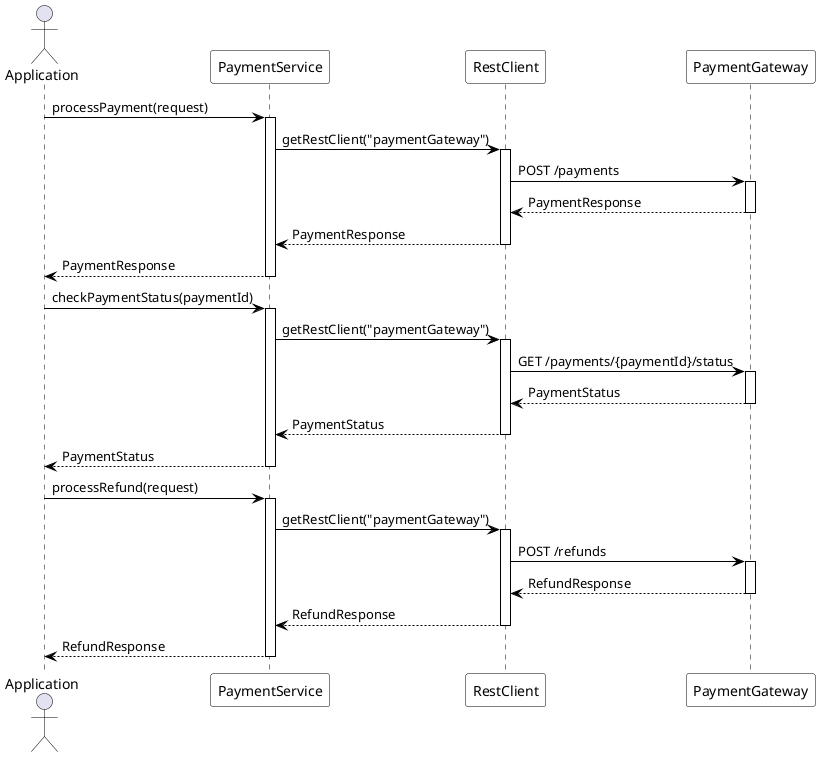

# Process API Commons REST

A Spring Boot library for making REST API calls using Apache HTTP Client with configurable properties.

## Features

- Support for multiple REST endpoints with independent configurations
- Synchronous REST API communication using Spring's RestClient
- Apache HTTP Client 5.x as the underlying HTTP client
- Configurable connection pooling per endpoint
- Configurable timeouts per endpoint
- SSL/TLS support with custom trust stores and key stores per endpoint
- Automatic certificate details logging during startup
- Comprehensive error handling with detailed error information
- Easy to extend and use in your Spring Boot applications
- Configurable REST client for multiple endpoints
- SSL/TLS support with custom trust stores and key stores
- Connection pooling with configurable settings
- Comprehensive error handling with detailed error information
- Request/Response interceptors for custom processing

## Non-Functional Requirements (NFR)

The library is designed to support the following Non-Functional Requirements:

### 1. Performance
- **Connection Pooling**: Efficient connection reuse with configurable pool sizes
  - Maximum total connections: Configurable via `max-total`
  - Connections per route: Configurable via `default-max-per-route`
  - Connection reuse: Automatic connection reuse for improved performance
  - Connection cleanup: Automatic cleanup of stale connections

- **Timeouts**: Configurable timeouts for different operations
  - Connect timeout: Configurable via `timeout.connect`
  - Read timeout: Configurable via `timeout.read`
  - Write timeout: Configurable via `timeout.write`

### 2. Scalability
- **Multiple Endpoints**: Support for multiple REST endpoints with independent configurations
- **Connection Management**: Efficient handling of concurrent requests
- **Resource Management**: Automatic cleanup of unused resources

### 3. Security
- **SSL/TLS Support**: Comprehensive SSL/TLS configuration
  - Custom trust stores per endpoint
  - Custom key stores per endpoint
  - Hostname verification
  - Certificate validation
  - Certificate details logging

### 4. Reliability
- **Error Handling**: Comprehensive error handling with detailed error information
  - HTTP status code handling
  - Exception mapping
  - Detailed error messages
  - Stack trace preservation

- **Connection Management**: Robust connection handling
  - Automatic retry for failed connections
  - Connection validation
  - Stale connection detection

### 5. Maintainability
- **Configuration**: Externalized configuration via YAML/properties
- **Logging**: Comprehensive logging of operations
  - Certificate details
  - Connection pool statistics
  - Error information
  - Operation metrics

### 6. Monitoring
- **Connection Pool Monitoring**: Track connection pool statistics
  - Active connections
  - Idle connections
  - Connection creation rate
  - Connection reuse rate

- **Certificate Monitoring**: Track certificate information
  - Certificate expiration
  - Certificate changes
  - Certificate validation

### 7. Extensibility
- **Custom Error Handling**: Ability to implement custom error handlers
- **Custom Interceptors**: Support for custom request/response interceptors
- **Interface-based Design**: Easy to extend and implement new clients

### 8. Compliance
- **Security Standards**: Support for industry-standard security practices
  - SSL/TLS 1.2/1.3
  - Certificate validation
  - Secure configuration

### 9. Integration
- **Spring Boot Integration**: Seamless integration with Spring Boot
- **Dependency Injection**: Support for Spring's dependency injection
- **Configuration Properties**: Integration with Spring's configuration system

### 10. Documentation
- **Code Documentation**: Comprehensive JavaDoc documentation
- **Usage Examples**: Detailed examples and best practices
- **Configuration Guide**: Clear configuration documentation

## Flow Diagram

Here's a flow diagram showing how to use the library in a payment service scenario:



## Example Usage

Here's a complete example of using the library for a payment service:

1. Define your client interface:
```java
public interface PaymentServiceClient extends RestClientBase {
    PaymentResponse processPayment(PaymentRequest request);
    RefundResponse processRefund(RefundRequest request);
    PaymentStatus checkPaymentStatus(String paymentId);
}
```

2. Configure the client in your application.yml:
```yaml
papi:
  rest-client:
    clients:
      paymentGateway:
        base-url: https://api.payment-gateway.com
        uri: /v1
        timeout:
          connect: 5s
          read: 30s
          write: 30s
        connection-pool:
          max-total: 20
          default-max-per-route: 10
        ssl:
          trust-store-path: /path/to/payment-gateway-truststore.jks
          trust-store-password: changeit
```

3. Implement the client:
```java
@Component
@RequiredArgsConstructor
public class PaymentServiceClientImpl implements PaymentServiceClient {
    private static final String PAYMENT_GATEWAY = "paymentGateway";
    private final Map<String, RestClient> restClients;

    @Override
    public PaymentResponse processPayment(PaymentRequest request) {
        return getRestClient(PAYMENT_GATEWAY)
                .post()
                .uri("/payments")
                .body(request)
                .retrieve()
                .body(PaymentResponse.class);
    }
}
```

4. Use the client in your service:
```java
@Service
@RequiredArgsConstructor
public class PaymentService {
    private final PaymentServiceClient paymentClient;

    public PaymentResponse processPayment(PaymentRequest request) {
        try {
            return paymentClient.processPayment(request);
        } catch (RestClientException e) {
            log.error("Payment processing failed", e);
            // Handle the error appropriately
            throw new PaymentProcessingException("Failed to process payment", e);
        }
    }
}
```

## Usage

1. Create an interface extending `RestClientBase`:
```java
public interface MyServiceClient extends RestClientBase {
    MyResponse getData(String id);
    void updateData(String id, MyRequest request);
}
```

2. Implement the interface:
```java
@Component
@RequiredArgsConstructor
public class MyServiceClientImpl implements MyServiceClient {
    private static final String SERVICE_NAME = "myService";
    private final Map<String, RestClient> restClients;

    @Override
    public MyResponse getData(String id) {
        return getRestClient(SERVICE_NAME)
                .get()
                .uri("/data/{id}", id)
                .retrieve()
                .body(MyResponse.class);
    }

    @Override
    public void updateData(String id, MyRequest request) {
        getRestClient(SERVICE_NAME)
                .put()
                .uri("/data/{id}", id)
                .body(request)
                .retrieve()
                .toBodilessEntity();
    }
}
```

3. Configure the client in your application.yml:
```yaml
papi:
  rest-client:
    clients:
      - name: myService
        base-url: https://api.myservice.com
        uri: /api/v1
        timeout:
          connect: 5s
          read: 30s
          write: 30s
        connection-pool:
          max-total: 20
          default-max-per-route: 10
          connection-time-to-live: 5m
        ssl:
          trust-store-path: /path/to/truststore.jks
          trust-store-password: changeit
        interceptors:
          enable-logging: true
          request-interceptors:
            - myCustomRequestInterceptor
          response-interceptors:
            - myCustomResponseInterceptor
        retry:
          enabled: true
          max-attempts: 3
          initial-interval: 100ms
          max-interval: 1s
          multiplier: 2.0
          retryable-status-codes:
            # Client Errors (4xx)
            - 408  # Request Timeout - Server timed out waiting for the request
            - 429  # Too Many Requests - Rate limiting or throttling
            - 499  # Client Closed Request - Client closed the connection before receiving a response
            
            # Server Errors (5xx)
            - 500  # Internal Server Error - Generic server error
            - 502  # Bad Gateway - Upstream server returned an invalid response
            - 503  # Service Unavailable - Server temporarily unable to handle requests
            - 504  # Gateway Timeout - Upstream server timed out
            - 507  # Insufficient Storage - Server is out of space
            - 509  # Bandwidth Limit Exceeded - Server bandwidth limit reached
            - 510  # Not Extended - Server needs further extensions to fulfill request
            - 511  # Network Authentication Required - Client needs to authenticate
            
            # Custom Status Codes
            - 520  # Web Server Returned an Unknown Error
            - 521  # Web Server Is Down
            - 522  # Connection Timed Out
            - 523  # Origin Is Unreachable
            - 524  # A Timeout Occurred
            - 525  # SSL Handshake Failed
            - 526  # Invalid SSL Certificate
            - 527  # Railgun Error
            - 530  # Site is frozen
            
          retryable-exceptions:
            - java.io.IOException
            - java.net.ConnectException
            - java.net.SocketTimeoutException
            - java.net.UnknownHostException
            - javax.net.ssl.SSLException
            - org.apache.hc.client5.http.HttpHostConnectException
            - org.apache.hc.client5.http.ConnectTimeoutException
            - org.apache.hc.client5.http.SocketTimeoutException
```

## Error Handling

The library provides comprehensive error handling through the `RestClientException` class. Here's how to handle errors:

```java
@Service
@RequiredArgsConstructor
public class MyService {
    private final MyServiceClient client;

    public MyResponse getData(String id) {
        try {
            return client.getData(id);
        } catch (RestClientException e) {
            log.error("Failed to get data for id: {}", id, e);
            // Handle specific error cases
            if (e.getStatusCode() == HttpStatus.NOT_FOUND) {
                throw new DataNotFoundException("Data not found for id: " + id);
            }
            throw new ServiceException("Failed to get data", e);
        }
    }
}
```

## Best Practices

1. **Connection Pool Configuration**
   - Set `max-total` based on your application's concurrent request needs
   - Configure `default-max-per-route` to prevent overwhelming a single service
   - Use `connection-time-to-live` to prevent stale connections

2. **Timeout Settings**
   - Set appropriate timeouts based on your service's response time
   - Consider using different timeouts for different operations
   - Monitor timeout occurrences and adjust accordingly

3. **SSL/TLS Configuration**
   - Use separate trust stores for different services
   - Regularly update certificates
   - Enable hostname verification for production environments

4. **Error Handling**
   - Always catch and handle `RestClientException`
   - Log detailed error information
   - Implement appropriate retry mechanisms for transient failures

5. **Retry Configuration**
   - Enable retry for transient failures
   - Configure appropriate retry intervals
   - Monitor retry attempts and adjust as needed

## Monitoring

The library provides several ways to monitor its operation:

1. **Connection Pool Statistics**
   - Monitor active and idle connections
   - Track connection creation and reuse rates
   - Watch for connection timeouts

2. **Certificate Information**
   - Certificate details are logged during startup
   - Monitor certificate expiration dates
   - Track certificate changes

3. **Error Logging**
   - Detailed error information is logged
   - HTTP status codes and error messages
   - Stack traces for debugging

4. **Retry Statistics**
   - Track retry attempts
   - Monitor retry success rates
   - Log retry failures

## Circuit Breaker

The library includes a circuit breaker implementation to prevent cascading failures and provide graceful degradation when external services are experiencing issues.

### Configuration

```yaml
rest-client:
  circuit-breaker:
    enabled: true
    failure-threshold: 5
    reset-timeout: 30s
    half-open-timeout: 10s
    health-check-interval: 5s
```

### Usage

```java
@Service
@RequiredArgsConstructor
public class PaymentService {
    private final CircuitBreakerFactory circuitBreakerFactory;
    private final PaymentServiceClient paymentClient;

    public PaymentResponse processPayment(PaymentRequest request) {
        CircuitBreaker circuitBreaker = circuitBreakerFactory.getCircuitBreaker(
            "payment-service",
            () -> paymentClient.checkHealth()
        );

        return circuitBreaker.execute(() -> paymentClient.processPayment(request));
    }
}
```

### States

The circuit breaker has three states:

1. **CLOSED**: Normal operation, requests are allowed through
2. **OPEN**: Circuit is open, requests are rejected
3. **HALF-OPEN**: Testing if the service has recovered

### Features

- Configurable failure threshold
- Automatic reset after timeout
- Health check integration
- Thread-safe implementation
- Graceful degradation

## Contributing

1. Fork the repository
2. Create a feature branch
3. Commit your changes
4. Push to the branch
5. Create a Pull Request

## License

This project is licensed under the MIT License - see the [LICENSE](LICENSE) file for details.

## Support

For support, please contact the Process API team or create an issue in the repository.

## Changelog

### 1.0.0-SNAPSHOT
- Initial release
- Support for multiple REST endpoints
- Configurable connection pooling
- SSL/TLS support
- Comprehensive error handling
- Request/Response interceptors
- Retry mechanism with exponential backoff